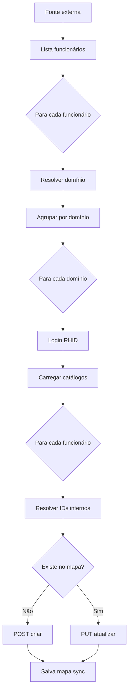

# Integração RHID — Documentação

## Visão geral

A integração exporta funcionários de uma **fonte externa** (mock ou API futura) para o **RHID** (`https://rhid.com.br/v2`).

Os dados dos funcionários **não são salvos** como pedestres. Apenas um mapa `dominio::idExterno → idRhid` fica em `TB_CONFIG_RHID.MAPA_IDS_RHID`.

---

## Roteamento por domínio

O **`idCompany` não identifica o domínio** — é o ID da empresa **dentro** do domínio RHID (campo do payload de cadastro). O que define **para qual domínio** exportar é o **`nomeDominio`** do funcionário (mesmo valor usado no parâmetro `domain` do login).

### Como o sistema decide o destino

| Situação | Comportamento |
|----------|---------------|
| Funcionário com **`nomeDominio`** | Exporta **somente** para o domínio cadastrado com esse nome |
| Funcionário **sem** `nomeDominio` + config **Ignorar** | Funcionário **não exportado** (mensagem no resultado) |
| Funcionário **sem** `nomeDominio` + config **Enviar para todos** | Exporta para **todos** os domínios da configuração |
| `nomeDominio` informado mas não cadastrado | **Erro** — funcionário ignorado com mensagem |

Configuração na tela: **Funcionário sem nomeDominio** (`TB_CONFIG_RHID.SEM_DOMINIO_ACAO`).

### Exemplo

| Domínio cadastrado |
|--------------------|
| `direcional1` |
| `direcional2` |

| Funcionário | nomeDominio | idCompany (no DTO) | Destino |
|-------------|-------------|--------------------|---------|
| João | `direcional1` | 7 | `direcional1` |
| Maria | `direcional2` | 2 | `direcional2` |
| Pedro | *(vazio)* | 7 | Ignorado ou todos (conforme config) |

O login RHID usa o **`domain`** (nome do domínio). IDs internos (`idCompany`, `idShift`, etc.) são **resolvidos automaticamente** via catálogos RHID quando a fonte externa informa **chaves de negócio** (CNPJ, nome da empresa, nome do horário, etc.).

---

## Catálogos RHID (pré-requisito por domínio)

Após login, a integração carrega os catálogos abaixo (formato **DataTables** — `GET` + Bearer token):

| Catálogo | Endpoint | Campo no funcionário | Prioridade de resolução |
|----------|----------|----------------------|-------------------------|
| **Empresas** | `GET /customerdb/company.svc/a` | `idCompany` | 1. `idCompany` 2. **`cnpjEmpresa`** (somente CNPJ) |
| **Horários** | `GET /customerdb/shift.svc/a` | `idShift` / `newIdShift` | 1. `idShift` 2. `nomeHorario` 3. **primeiro do catálogo** |
| **Departamentos** | `GET /customerdb/department.svc/a` | `idDepartment` | 1. `idDepartment` 2. `nomeDepartamento` |
| **Centros de custo** | `GET /customerdb/costcenter.svc/a` | `idCostCenter` | 1. `idCostCenter` 2. `nomeCentroCusto` |
| **Cargos** | `GET /customerdb/personrole.svc/a` | `idPersonRole` | 1. `idPersonRole` 2. `nomeCargo` |

Query mínima: `draw=1&start=0&length=500&order[0][column]=1&order[0][dir]=asc` (+ colunas id/name).

Implementação: `RhidCatalogoLoader` + `RhidCatalogoResolver` (cache **por domínio**, recarregado a cada exportação).

**Resolução por nome:** empresa é **obrigatória** — se não encontrar no catálogo, o funcionário é **rejeitado**. **Horário:** busca por `nomeHorario`; se não encontrar (ou não informado), usa o **primeiro horário** do catálogo. Departamento, centro de custo e cargo são **opcionais** — se o nome não existir (ou houver mais de um match), o campo **não é vinculado** (`null` no JSON enviado ao RHID).

---

## Campos do POST/PUT `/customerdb/person.svc/a`

Legenda:
- **Obr. API** — exigido pela documentação RHID no cadastro (POST)
- **Mapeado** — enviado pela integração hoje
- **Origem** — campo em `RhidFuncionarioExternoDTO` ou valor padrão

### Obrigatórios no cadastro (POST)

| Campo RHID | Obr. API | Mapeado | Origem / comportamento |
|------------|----------|---------|-------------------------|
| `status` | Sim | Sim | `funcionario.status` (padrão `1` = ativo) |
| `dateShiftsStartStr` | Sim (POST) | Sim | `dataAdmissao` formato `yyyyMMdd` |
| `newIdShift` | Sim (POST) | Sim | `funcionario.idShift` — resolvido automaticamente (nome ou primeiro do catálogo) |
| `idCompany` | Sim | Sim | `funcionario.idCompany` — **obrigatório**; sem valor → ignorado |
| `name` | Sim | Sim | `funcionario.nome` |
| `pis` | Sim | Sim | `funcionario.pis` ou **`9` + CPF** se PIS ausente |
| `cpf` | Opcional na API* | Sim | `funcionario.cpf` (número JSON); *obrigatório na nossa validação |
| `admissionDate` | Recomendado | Sim | `dataAdmissao` formato `/Date(ms±HHMM)/` |
| `admissionDateStr` | Alternativa | Sim (null) | Enviamos `admissionDate`; `admissionDateStr` fica null |

### Opcionais mapeados (enviados se preenchidos na fonte externa)

| Campo RHID | Mapeado | Origem DTO |
|------------|---------|------------|
| `registration` | Sim | `matricula` |
| `email` | Sim | `email` |
| `idDepartment` | Sim | `idDepartment` ou `nomeDepartamento` → catálogo; **null se não encontrado** |
| `idCostCenter` | Sim | `idCostCenter` ou `nomeCentroCusto` → catálogo; **null se não encontrado** |
| `idPersonRole` | Sim | `idPersonRole` ou `nomeCargo` → catálogo; **null se não encontrado** |
| `idPersonBoss` | Sim | `idPersonBoss` |
| `numFolha` | Sim | `numFolha` |
| `ctps` | Sim | `ctps` |
| `rg` | Sim | `rg` |
| `city` | Sim | `cidade` |
| `address` | Sim | `endereco` |
| `district` | Sim | `bairro` |
| `state` | Sim | `uf` |
| `zip` | Sim | `cep` |
| `phone` | Sim | `telefone` |
| `dateOfBirth` | Sim | `dataNascimento` |
| `admin` | Sim | `admin` (padrão `false`) |

### Enviados com valor padrão fixo (não vêm da fonte externa)

| Campo RHID | Valor padrão |
|------------|--------------|
| `excluded` | `false` |
| `applyAllGeofences` | `true` |
| `area` | `0` |
| `barcode` | `""` |
| `cardCode` | `0` |
| `codigo` | `0` |
| `password` | `0` |
| `pin` | `0` |
| `rfid` | `0` |
| `saldoBancoHoras` | `0` |
| `viaCracha` | `1` |
| `idShiftAtual` | `0` |
| `fotoPontoObrigatoriaWeb` | `true` |
| `genericShiftStartDateSelector` | `false` |
| `menuHistorico` | `true` |
| `menuInformacoesGerais` | `false` |
| `menuPontoDiario` | `false` |
| `menuQuiosque` | `true` |
| `menuSolicitacoes` | `true` |
| `permitirAlteracaoWeb` | `false` |
| `permitirMarcacaoWeb` | `false` |
| `useGeofencing` | `false` |
| `statusStr` | `"Ativo"` / `"Inativo"` (somente POST) |

### Ainda não mapeados (presentes no curl RHID)

| Campo RHID | Observação |
|------------|------------|
| `approvalFlow`, `approvalFlowName`, `idApprovalFlow` | Fluxo de aprovação |
| `cardExibitType`, `cardTech`, `rfidString`, `rfidStringCsv` | Cartão / RFID texto |
| `companyName`, `companyTradingName`, `departmentName`, `costCenterName`, `roleName` | Nomes descritivos (somente leitura na UI RHID) |
| `dateOfBirthStr`, `dismissalDate`, `dismissalDateStr`, `idReasonDismissal` | Demissão / datas texto |
| `extension`, `fatherName`, `motherName`, `gender`, `nationality`, `placeOfBirth`, `maritalStatus` | Dados pessoais extras |
| `foto`, `fotoPontoObrigatoria` | Foto |
| `idCustomer`, `idShifts`, `personShifts`, `shifts`, `shiftAtualName` | Horários múltiplos |
| `inicioBancoHoras`, `inicioBancoHorasStr`, `saldoBancoHoras` (valor dinâmico) | Banco de horas |
| `lastChange` | Controle interno RHID |
| `listsDB`, `operators`, `personGeofences`, `selectedGeofencesId` | Geofence / operadores |
| `modoQuiosque`, `permitirMarcacaoMobile` | Permissões mobile |
| `newPassword`, `senhaAcessoWeb` | Senha web |
| `qrCodeInfo`, `templateArray`, `templates` | Biometria / templates |
| `barcode` (dinâmico) | Código de barras crachá |

Estes podem ser adicionados em `RhidFuncionarioExternoDTO` + `RhidPersonPayloadBuilder` quando a API externa fornecer os dados.

---

## Regra do PIS

1. Se **tem PIS** → envia o PIS (somente números).
2. Se **não tem PIS** → envia **`9` + CPF** (12 dígitos). Ex.: CPF `11144477735` → PIS `911144477735`.

CPF: **11 dígitos obrigatórios** na validação interna.

---

## Campos obrigatórios na fonte externa (integração)

| Campo DTO | Obrigatório | Uso |
|-----------|-------------|-----|
| `idExterno` | Sim | Chave no mapa de sync |
| `nome` | Sim | RHID `name` |
| `cpf` | Sim | RHID `cpf` + fallback PIS |
| `nomeDominio` | Sim* | Roteamento (*obrigatório salvo config "enviar para todos") |
| **`idCompany`** | Sim** | ID direto **ou** `cnpjEmpresa` → catálogo (**somente CNPJ**) |
| `pis` | Não | Se ausente → `9+cpf` |
| **`idShift`** | Sim** (POST) | ID direto, `nomeHorario` → catálogo, ou **primeiro horário** se não encontrar |
| **`cnpjEmpresa`** | Cond. | Obrigatório se `idCompany` ausente — busca empresa no RHID |
| `nomeHorario` | Cond. | Resolve `idShift`; se não achar → **primeiro horário** do catálogo |
| `nomeDepartamento` | Não | Resolve `idDepartment`; se não achar no catálogo → **não vincula** (null) |
| `nomeCentroCusto` | Não | Resolve `idCostCenter`; se não achar no catálogo → **não vincula** (null) |
| `nomeCargo` | Não | Resolve `idPersonRole`; se não achar no catálogo → **não vincula** (null) |
| `status` | Não | Padrão `1` |
| `dataAdmissao` | Não | Usa data atual |
| `dataAlteracao` | Não | Watermark diário (`ultimaExportacao`) após exportação TOTVS |

---

## Integração TOTVS (filtro diário)

A sentença `API.PTO.001` via `wsConsultaSQL` aceita apenas **`DATA_INI=yyyy-MM-dd`** (sem hora). Por isso:

| Modo | Parâmetros SOAP | Comportamento |
|------|-----------------|---------------|
| **Completa** | `DATA_INI` = data início configurada; `ATIVO=1` | Somente funcionários **ativos** |
| **Incremental** | `DATA_INI` = **`ultimaExportacao`** (mesmo dia, sem +1); `ATIVO=0` | Alterações e **inativos** desde essa data |
| **Automática** | Timer **1x por dia** por configuração (`horaExecucaoAutomatica`, padrão **22h**) | Só ativável após **importação completa**; depois incremental |

### Por que `DATA_INI` não soma +1 dia

Com `DATA_INI = ultimaExportacao + 1`, alterações gravadas na TOTVS **no mesmo dia** após a rotina (ex.: admissão às 14h com `DATAALTERACAO=2026-06-02`) ficam **fora** da próxima consulta (`DATA_INI=2026-06-03`).

Usando **`DATA_INI = ultimaExportacao`**, a próxima execução reconsulta o último dia processado e captura pendências. Registros já exportados são **atualizados via PUT** no RHID (idempotente) — o custo extra de reprocessar o dia é aceitável frente à segurança dos dados.

### Watermark (`ultimaExportacao`)

Após exportação **sem erros**:

- `ultimaExportacao` = maior `DATAALTERACAO` retornada pela TOTVS
- Se nenhum registro vier, avança para **hoje** (evita repetir a mesma consulta vazia indefinidamente)

Com erro, `ultimaExportacao` **não avança** — a próxima incremental reprocessa o mesmo `DATA_INI`.

**Recomendação operacional:** agendar a rotina **1x por dia**, após o processamento da folha na TOTVS (padrão **22h**). A exportação automática só pode ser ativada **após importação completa** bem-sucedida. Cada configuração cadastrada recebe **timer próprio** quando a automática está ligada.
| Demais opcionais | Não | Ver tabela acima |

---

## Fluxo de exportação



---

## Persistência

### Mapa de IDs (`MAPA_IDS_RHID`)

Chave: `{dominio}::{idExterno}` (domínio em minúsculas)

```json
{
  "direcional1::EXT001": 15,
  "direcional2::EXT002": 22
}
```

### Domínio (`TB_DOMINIO_RHID`)

| Campo | Uso |
|-------|-----|
| `NOME_DOMINIO` | Login (`domain`) e roteamento via `nomeDominio` do funcionário |

Somente o **nome do domínio** é necessário. `idCompany`, `idShift` e demais dados do funcionário vêm **exclusivamente** da API externa.

---

## Modos de exportação

| Modo | Comportamento |
|------|---------------|
| Completa | TOTVS: `ATIVO=1` desde `dataInicioCompleta` |
| Incremental | TOTVS: `ATIVO=0` com `DATA_INI = ultimaExportacao` (filtro diário) |
| Automática | Completa manual obrigatória antes de ativar; depois incremental **1x/dia por config** |

---

## Arquivos principais

| Arquivo | Função |
|---------|--------|
| `RhidDominioResolver` | Roteamento funcionário → domínio |
| `RhidPersonPayloadBuilder` | JSON RHID |
| `RhidPisUtil` | Regra `9 + CPF` |
| `RhidIntegracaoEJB` | Orquestração |
| `RhidFuncionarioExternoDTO` | Modelo da fonte externa |

---

## Tela

**Configuração → Integração RHID** — `/paginas/sistema/rhid/rhidConfig.xhtml`

Cadastre cada domínio com o **nome** correto (`domain` do login). Informe **`nomeDominio`** na API externa para rotear cada funcionário.

### Migração de banco

Se a coluna ainda não existir:

```sql
ALTER TABLE TB_CONFIG_RHID ADD SEM_DOMINIO_ACAO VARCHAR(20) DEFAULT 'IGNORAR';
```
